# K-NN Explation(Simple Example)

<h1>Table of Contents<span class="tocSkip"></span></h1>
<div class="toc"><ul class="toc-item"><li><span><a href="#K-NN-Explation(Simple-Example)" data-toc-modified-id="K-NN-Explation(Simple-Example)-1"><span class="toc-item-num">1&nbsp;&nbsp;</span>K-NN Explation(Simple Example)</a></span><ul class="toc-item"><li><span><a href="#Importing-Libraries" data-toc-modified-id="Importing-Libraries-1.1"><span class="toc-item-num">1.1&nbsp;&nbsp;</span>Importing Libraries</a></span></li></ul></li><li><span><a href="#function-to-plot/-visualize-data" data-toc-modified-id="function-to-plot/-visualize-data-2"><span class="toc-item-num">2&nbsp;&nbsp;</span>function to plot/ visualize data</a></span></li><li><span><a href="#Examples" data-toc-modified-id="Examples-3"><span class="toc-item-num">3&nbsp;&nbsp;</span>Examples</a></span><ul class="toc-item"><li><span><a href="#Example-1-(Overlap)" data-toc-modified-id="Example-1-(Overlap)-3.1"><span class="toc-item-num">3.1&nbsp;&nbsp;</span>Example-1 (Overlap)</a></span></li><li><span><a href="#Example-2(U-shape-data)" data-toc-modified-id="Example-2(U-shape-data)-3.2"><span class="toc-item-num">3.2&nbsp;&nbsp;</span>Example-2(U-shape data)</a></span></li><li><span><a href="#Example-3(concentric-circle-data)" data-toc-modified-id="Example-3(concentric-circle-data)-3.3"><span class="toc-item-num">3.3&nbsp;&nbsp;</span>Example-3(concentric circle data)</a></span></li><li><span><a href="#Example-4-(two-concentric-circle)" data-toc-modified-id="Example-4-(two-concentric-circle)-3.4"><span class="toc-item-num">3.4&nbsp;&nbsp;</span>Example-4 (two concentric circle)</a></span></li><li><span><a href="#Example-5-(Linear)" data-toc-modified-id="Example-5-(Linear)-3.5"><span class="toc-item-num">3.5&nbsp;&nbsp;</span>Example-5 (Linear)</a></span></li><li><span><a href="#Example-6-(outlier)" data-toc-modified-id="Example-6-(outlier)-3.6"><span class="toc-item-num">3.6&nbsp;&nbsp;</span>Example-6 (outlier)</a></span></li><li><span><a href="#Example-7-(X-OR)" data-toc-modified-id="Example-7-(X-OR)-3.7"><span class="toc-item-num">3.7&nbsp;&nbsp;</span>Example-7 (X-OR)</a></span></li><li><span><a href="#Example-8-(two-spirals)" data-toc-modified-id="Example-8-(two-spirals)-3.8"><span class="toc-item-num">3.8&nbsp;&nbsp;</span>Example-8 (two spirals)</a></span></li><li><span><a href="#Example-9(random)" data-toc-modified-id="Example-9(random)-3.9"><span class="toc-item-num">3.9&nbsp;&nbsp;</span>Example-9(random)</a></span></li></ul></li><li><span><a href="#Summary" data-toc-modified-id="Summary-4"><span class="toc-item-num">4&nbsp;&nbsp;</span>Summary</a></span></li></ul></div>

## Importing Libraries


```python
import numpy as np
import matplotlib.pyplot as plt
from sklearn import datasets, neighbors

```


```python
# https://anaconda.org/conda-forge/mlxtend
from mlxtend.plotting import plot_decision_regions
import pandas as pd
```


```python
pd.read_csv('demo_data/6.overlap.csv').head(5)
```


<div>
<style scoped>
    .dataframe tbody tr th:only-of-type {
        vertical-align: middle;
    }

    .dataframe tbody tr th {
        vertical-align: top;
    }

    .dataframe thead th {
        text-align: right;
    }
</style>
<table border="1" class="dataframe">
  <thead>
    <tr style="text-align: right;">
      <th></th>
      <th>7</th>
      <th>3.2</th>
      <th>0</th>
    </tr>
  </thead>
  <tbody>
    <tr>
      <th>0</th>
      <td>6.4</td>
      <td>3.2</td>
      <td>0</td>
    </tr>
    <tr>
      <th>1</th>
      <td>6.9</td>
      <td>3.1</td>
      <td>0</td>
    </tr>
    <tr>
      <th>2</th>
      <td>5.5</td>
      <td>2.3</td>
      <td>0</td>
    </tr>
    <tr>
      <th>3</th>
      <td>6.5</td>
      <td>2.8</td>
      <td>0</td>
    </tr>
    <tr>
      <th>4</th>
      <td>5.7</td>
      <td>2.8</td>
      <td>0</td>
    </tr>
  </tbody>
</table>
</div>


```python
data = pd.read_csv('demo_data/6.overlap.csv', names=['x1', 'x2', 'y'])
```


```python
data.head(5)
```


<div>
<style scoped>
    .dataframe tbody tr th:only-of-type {
        vertical-align: middle;
    }

    .dataframe tbody tr th {
        vertical-align: top;
    }

    .dataframe thead th {
        text-align: right;
    }
</style>
<table border="1" class="dataframe">
  <thead>
    <tr style="text-align: right;">
      <th></th>
      <th>x1</th>
      <th>x2</th>
      <th>y</th>
    </tr>
  </thead>
  <tbody>
    <tr>
      <th>0</th>
      <td>7.0</td>
      <td>3.2</td>
      <td>0</td>
    </tr>
    <tr>
      <th>1</th>
      <td>6.4</td>
      <td>3.2</td>
      <td>0</td>
    </tr>
    <tr>
      <th>2</th>
      <td>6.9</td>
      <td>3.1</td>
      <td>0</td>
    </tr>
    <tr>
      <th>3</th>
      <td>5.5</td>
      <td>2.3</td>
      <td>0</td>
    </tr>
    <tr>
      <th>4</th>
      <td>6.5</td>
      <td>2.8</td>
      <td>0</td>
    </tr>
  </tbody>
</table>
</div>


```python
#data[['x1','x2']]
```


```python
#data[['x1','x2']].values
```

# function to plot/ visualize data


```python
def knn_comparision(data, k):
    X = data[['x1','x2']].values
    y = data['y'].astype(int).values
    clf = neighbors.KNeighborsClassifier(n_neighbors=k)
    clf.fit(X, y)

    # Plotting decision regions
    plot_decision_regions(X, y, clf=clf, legend=2)

    # Adding axes annotations
    plt.xlabel('X1')
    plt.ylabel('X2')
    plt.title('Knn with K='+ str(k))
    plt.show()
```

# Examples

## Example-1 (Overlap)


```python
data = pd.read_csv('demo_data/6.overlap.csv', names=['x1', 'x2', 'y'])
for i in [1, 5, 15, 30, 45]:
    knn_comparision(data, i)
```


    
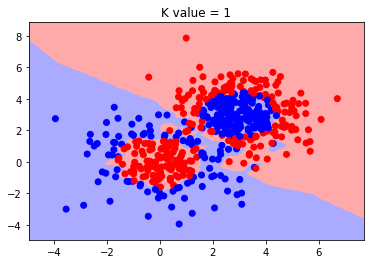
    


    
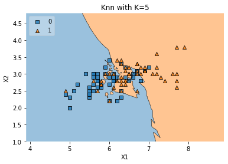
    


    
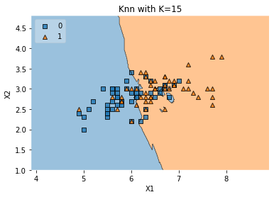
    


    
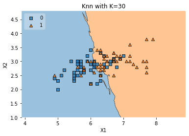
    


    
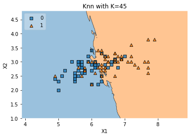
    


## Example-2(U-shape data)


```python
data = pd.read_csv('demo_data/1.ushape.csv', names=['x1', 'x2', 'y'])
print(data.head(3))
for i in [1, 5, 15, 30, 45]:
    knn_comparision(data, i)
```

             x1        x2    y
    0  0.031595  0.986988  0.0
    1  2.115098 -0.046244  1.0
    2  0.882490 -0.075756  0.0
    


    
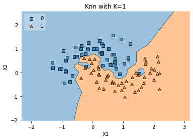
    


    
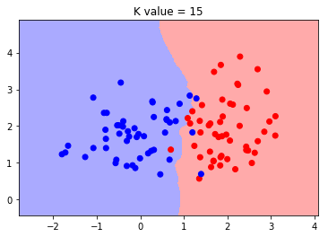
    


    
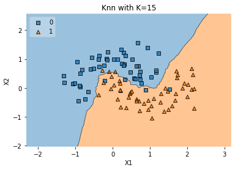
    


    
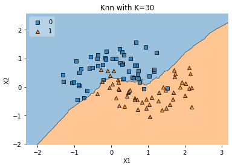
    


    
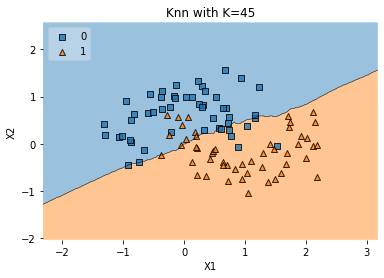
    


## Example-3(concentric circle data)


```python
data = pd.read_csv('demo_data/2.concerticcir1.csv', names=['x1', 'x2', 'y'])
print(data.head(3))
for i in [1, 5, 15, 30, 45]:
    knn_comparision(data, i)
```

             x1        x2    y
    0 -0.382891 -0.090840  1.0
    1 -0.020962 -0.477874  1.0
    2 -0.396116 -1.289427  0.0
    


    

    


    
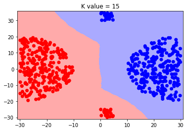
    


    
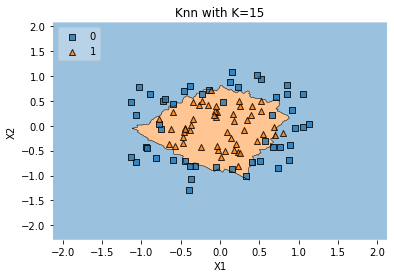
    


    
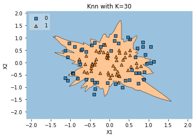
    


    
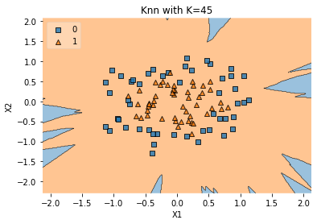
    


## Example-4 (two concentric circle)


```python
data = pd.read_csv('demo_data/3.concertriccir2.csv', names=['x1', 'x2', 'y'])
print(data.head(3))

for i in [1, 5, 15, 30, 45]:
    knn_comparision(data, i)
```

             x1        x2    y
    0  0.700335 -0.247068  0.0
    1 -3.950019  2.740080  1.0
    2  0.150222 -2.157638  1.0
    


    
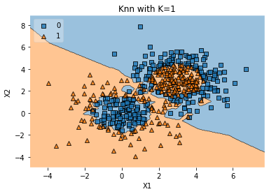
    


    
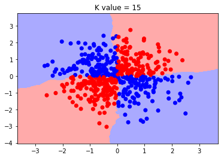
    


    
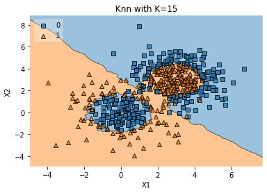
    


    

    


    
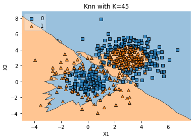
    


## Example-5 (Linear)


```python
data = pd.read_csv('demo_data/4.linearsep.csv', names=['x1', 'x2', 'y'])
print(data.head(3))
for i in [1, 5, 15, 30, 45]:
    knn_comparision(data, i)
```

             x1        x2    y
    0 -0.177497  0.930496  1.0
    1  1.977424  1.766155  0.0
    2  1.800024  1.700343  0.0
    


    
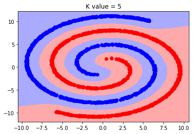
    


    
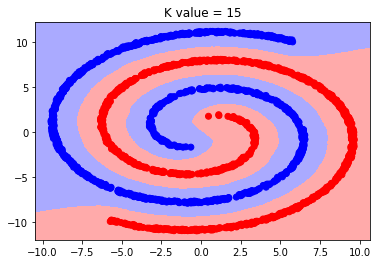
    


    
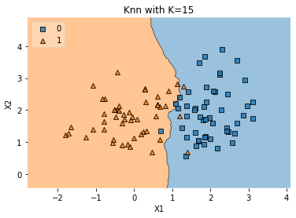
    


    
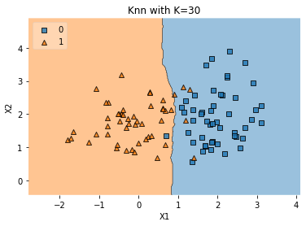
    


    
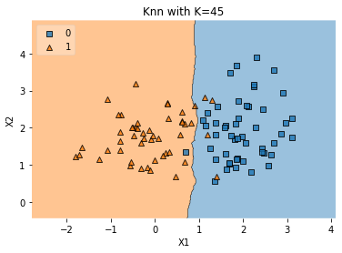
    


## Example-6 (outlier)


```python
data = pd.read_csv('demo_data/5.outlier.csv', names=['x1', 'x2', 'y'])
print(data.head(3))
for i in [1, 5, 15, 30, 45]:
    knn_comparision(data, i)
```

              x1        x2  y
    0 -17.897000  7.662423  0
    1 -26.343161 -3.055257  0
    2 -19.059771 -8.531838  0
    


    

    


    
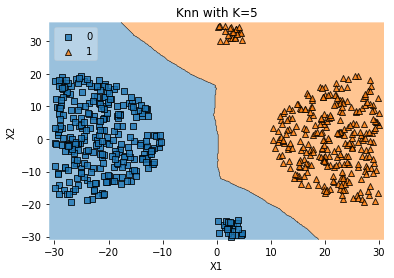
    


    
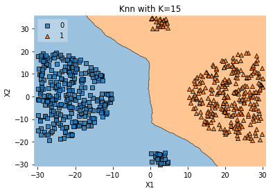
    


    

    


    
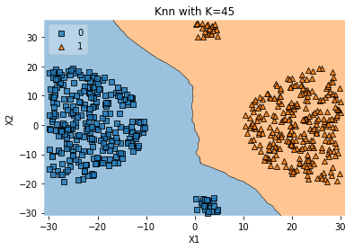
    


## Example-7 (X-OR)

**X-OR**

| 0      | 0 |1|
| ----------- | ----------- |--|
| 0     | 0 |    1  |
| 1   | 1   |  0   |


```python
data = pd.read_csv('demo_data/7.xor.csv', names=['x1', 'x2', 'y'])
print(data.head(3))
for i in [1, 5, 15, 30, 45]:
    knn_comparision(data, i)
```

             x1        x2    y
    0  1.764052  0.400157 -1.0
    1  0.978738  2.240893 -1.0
    2  1.867558 -0.977278  1.0
    


    

    


    
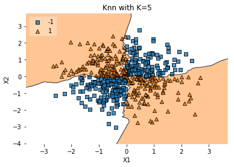
    


    
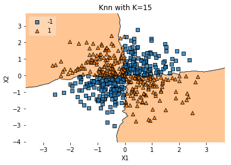
    


    
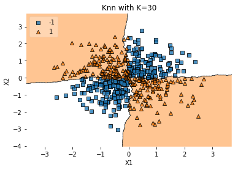
    


    

    


## Example-8 (two spirals)


```python
data = pd.read_csv('demo_data/8.twospirals.csv', names=['x1', 'x2', 'y'])
print(data.head(3))
for i in [1, 5, 15, 30, 45]:
    knn_comparision(data, i)
```

             x1         x2  y
    0 -2.543456 -10.816358  0
    1  9.434466  -2.572000  0
    2  3.368646 -10.194671  0
    


    
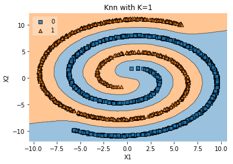
    


    

    


    
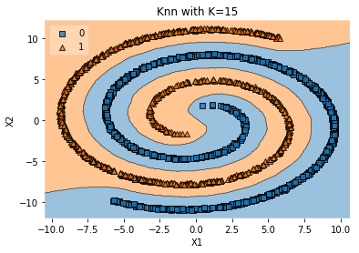
    


    
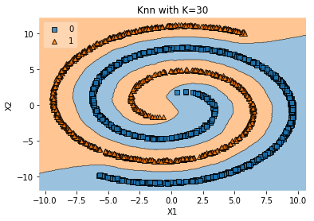
    


    
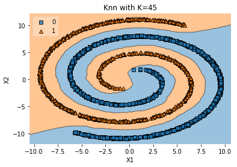
    


## Example-9(random)


```python
data = pd.read_csv('demo_data/9.random.csv', names=['x1', 'x2', 'y'])
print(data.head(3))
for i in [1, 5, 15, 30, 45]:
    knn_comparision(data, i)
```

          x1    x2    y
    0  0.374  1.08  0.0
    1  0.445  1.14  1.0
    2  0.514  1.13  0.0
    


    
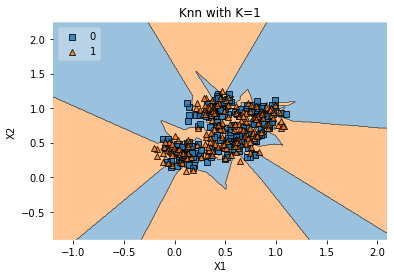
    


    
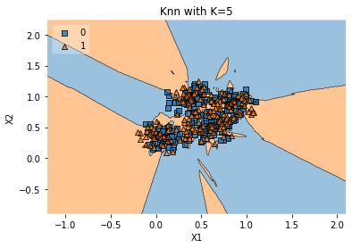
    


    
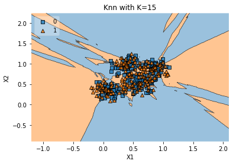
    


    
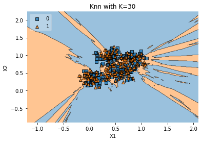
    


    
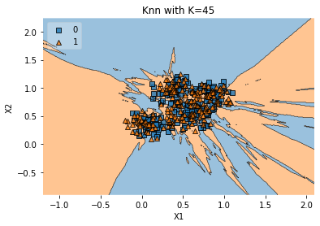
    


# Summary


1. initially dataset is loaded into the variable called "data"(using np.genfromtxt which is responsible for loading data from txt)
2. calling the knn_comparision by passing "data" and "k_value(no.of neighbours)" as an arguments.
3. variable "X" contains all elements with first 2 coloumns(such as coloumn 0 and 1).variable "y" contains coloumn 2(which are class labels).
4. generating the classifier using KNN Classifier with "n_neighbours" by using fit function model will be created.

5. To visualize the whole data,we are predicting the value of an element in each grid by using "classifier.predict" function.Now we are having each grid class.
6. By using pcolormesh we will color the grids(such as (xx,yy) points) based on class of a point which lies in grid.
now we got the decision boudary with 2 different colours.
7. To visualize our data points ,we will plot them using scatterplotter based on class of an each data point.
Correct me if i am wrong at any point?


---
