<h1>Table of Contents<span class="tocSkip"></span></h1>
<div class="toc"><ul class="toc-item"><li><span><a href="#K-NN-Exampls" data-toc-modified-id="K-NN-Exampls-1"><span class="toc-item-num">1&nbsp;&nbsp;</span>K-NN Exampls</a></span></li><li><span><a href="#Function-to-plot" data-toc-modified-id="Function-to-plot-2"><span class="toc-item-num">2&nbsp;&nbsp;</span>Function to plot</a></span><ul class="toc-item"><li><span><a href="#Meshgrid-explanation" data-toc-modified-id="Meshgrid-explanation-2.1"><span class="toc-item-num">2.1&nbsp;&nbsp;</span>Meshgrid explanation</a></span></li></ul></li><li><span><a href="#Examples" data-toc-modified-id="Examples-3"><span class="toc-item-num">3&nbsp;&nbsp;</span>Examples</a></span><ul class="toc-item"><li><span><a href="#Example-1" data-toc-modified-id="Example-1-3.1"><span class="toc-item-num">3.1&nbsp;&nbsp;</span>Example-1</a></span></li><li><span><a href="#Example-2" data-toc-modified-id="Example-2-3.2"><span class="toc-item-num">3.2&nbsp;&nbsp;</span>Example-2</a></span></li><li><span><a href="#Example-3" data-toc-modified-id="Example-3-3.3"><span class="toc-item-num">3.3&nbsp;&nbsp;</span>Example-3</a></span></li><li><span><a href="#Example-4" data-toc-modified-id="Example-4-3.4"><span class="toc-item-num">3.4&nbsp;&nbsp;</span>Example-4</a></span></li><li><span><a href="#Example-5" data-toc-modified-id="Example-5-3.5"><span class="toc-item-num">3.5&nbsp;&nbsp;</span>Example-5</a></span></li><li><span><a href="#Example-6" data-toc-modified-id="Example-6-3.6"><span class="toc-item-num">3.6&nbsp;&nbsp;</span>Example-6</a></span></li><li><span><a href="#Example-7" data-toc-modified-id="Example-7-3.7"><span class="toc-item-num">3.7&nbsp;&nbsp;</span>Example-7</a></span></li><li><span><a href="#Example-8" data-toc-modified-id="Example-8-3.8"><span class="toc-item-num">3.8&nbsp;&nbsp;</span>Example-8</a></span></li><li><span><a href="#Example-9" data-toc-modified-id="Example-9-3.9"><span class="toc-item-num">3.9&nbsp;&nbsp;</span>Example-9</a></span></li></ul></li></ul></div>

# K-NN Exampls


```python
import numpy as np
import matplotlib.pyplot as plt

from sklearn import datasets, neighbors

```

# Function to plot


```python
from matplotlib.colors import ListedColormap


def knn_comparison(data, n_neighbors = 15):
    '''
    This function finds k-NN and plots the data.
    '''
    X = data[:, :2]
    y = data[:,2] 
    
    
    # grid cell size
    h = .02
    cmap_light = ListedColormap(['#FFAAAA',  '#AAAAFF'])
    cmap_bold = ListedColormap(['#FF0000', '#0000FF'])


    # the core classifier: k-NN
    clf = neighbors.KNeighborsClassifier(n_neighbors)
    clf.fit(X, y)

    x_min, x_max = X[:, 0].min() - 1, X[:, 0].max() + 1
    y_min, y_max = X[:, 1].min() - 1, X[:, 1].max() + 1
    
    # we create a mesh grid (x_min,y_min) to (x_max y_max) with 0.02 grid spaces
    xx, yy = np.meshgrid(np.arange(x_min, x_max, h), np.arange(y_min, y_max, h))
    
    # we predict the value (either 0 or 1) of each element in the grid
    Z = clf.predict(np.c_[xx.ravel(), yy.ravel()])
    
    # xx.ravel() will give a flatten array

    # np.c_ : Translates slice objects to concatenation along the second axis.
    # > np.c_[np.array([1,2,3]), np.array([4,5,6])]
    # > array([[1, 4],
    #          [2, 5],
    #          [3, 6]])   (source: np.c_ documentation)
    
    
    
    
    # convert the out back to the xx shape (we need it to plot the decission boundry)
    Z = Z.reshape(xx.shape)
    
    
    # pcolormesh will plot the (xx,yy) grid with colors according to the values of Z
    # it looks like decision boundry
    plt.figure()
    plt.pcolormesh(xx, yy, Z, cmap=cmap_light)
   
    # scatter plot of with given points
    plt.scatter(X[:, 0], X[:, 1], c=y, cmap=cmap_bold)
    
    #defining scale on both axises
    plt.xlim(xx.min(), xx.max())
    plt.ylim(yy.min(), yy.max())
   
    # set the title
    plt.title('K value = '+str(n_neighbors))
    

    plt.show()
```

## Meshgrid explanation


please check this link <a href='https://stackoverflow.com/a/36014586'> stackoverflow meshgrid explanation </a>

# Examples

## Example-1


```python
data = np.genfromtxt('demo_data/6.overlap.csv', delimiter=',')
knn_comparison(data, 1)
knn_comparison(data, 5)
knn_comparison(data,15)
knn_comparison(data, 30)
knn_comparison(data, 50)

```

    <ipython-input-6-daa969aedd25>:50: MatplotlibDeprecationWarning: shading='flat' when X and Y have the same dimensions as C is deprecated since 3.3.  Either specify the corners of the quadrilaterals with X and Y, or pass shading='auto', 'nearest' or 'gouraud', or set rcParams['pcolor.shading'].  This will become an error two minor releases later.
      plt.pcolormesh(xx, yy, Z, cmap=cmap_light)
    


    
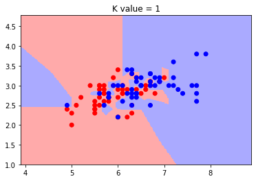
    


    <ipython-input-6-daa969aedd25>:50: MatplotlibDeprecationWarning: shading='flat' when X and Y have the same dimensions as C is deprecated since 3.3.  Either specify the corners of the quadrilaterals with X and Y, or pass shading='auto', 'nearest' or 'gouraud', or set rcParams['pcolor.shading'].  This will become an error two minor releases later.
      plt.pcolormesh(xx, yy, Z, cmap=cmap_light)
    


    
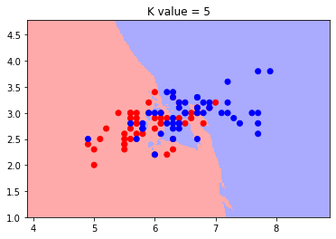
    


    <ipython-input-6-daa969aedd25>:50: MatplotlibDeprecationWarning: shading='flat' when X and Y have the same dimensions as C is deprecated since 3.3.  Either specify the corners of the quadrilaterals with X and Y, or pass shading='auto', 'nearest' or 'gouraud', or set rcParams['pcolor.shading'].  This will become an error two minor releases later.
      plt.pcolormesh(xx, yy, Z, cmap=cmap_light)
    


    
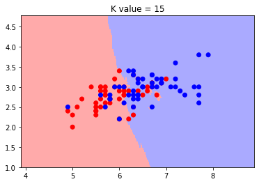
    


    <ipython-input-6-daa969aedd25>:50: MatplotlibDeprecationWarning: shading='flat' when X and Y have the same dimensions as C is deprecated since 3.3.  Either specify the corners of the quadrilaterals with X and Y, or pass shading='auto', 'nearest' or 'gouraud', or set rcParams['pcolor.shading'].  This will become an error two minor releases later.
      plt.pcolormesh(xx, yy, Z, cmap=cmap_light)
    


    
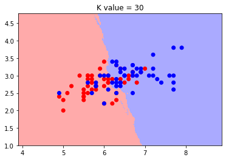
    


    <ipython-input-6-daa969aedd25>:50: MatplotlibDeprecationWarning: shading='flat' when X and Y have the same dimensions as C is deprecated since 3.3.  Either specify the corners of the quadrilaterals with X and Y, or pass shading='auto', 'nearest' or 'gouraud', or set rcParams['pcolor.shading'].  This will become an error two minor releases later.
      plt.pcolormesh(xx, yy, Z, cmap=cmap_light)
    


    

    


## Example-2


```python
data = np.genfromtxt('demo_data/1.ushape.csv', delimiter=',')
knn_comparison(data, 1)
knn_comparison(data, 5)
knn_comparison(data,15)
knn_comparison(data,30)

```

    <ipython-input-3-daa969aedd25>:50: MatplotlibDeprecationWarning: shading='flat' when X and Y have the same dimensions as C is deprecated since 3.3.  Either specify the corners of the quadrilaterals with X and Y, or pass shading='auto', 'nearest' or 'gouraud', or set rcParams['pcolor.shading'].  This will become an error two minor releases later.
      plt.pcolormesh(xx, yy, Z, cmap=cmap_light)
    


    
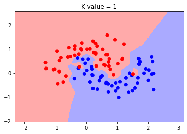
    


    <ipython-input-3-daa969aedd25>:50: MatplotlibDeprecationWarning: shading='flat' when X and Y have the same dimensions as C is deprecated since 3.3.  Either specify the corners of the quadrilaterals with X and Y, or pass shading='auto', 'nearest' or 'gouraud', or set rcParams['pcolor.shading'].  This will become an error two minor releases later.
      plt.pcolormesh(xx, yy, Z, cmap=cmap_light)
    


    
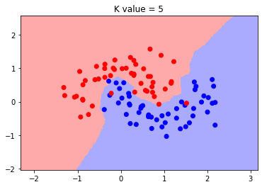
    


    <ipython-input-3-daa969aedd25>:50: MatplotlibDeprecationWarning: shading='flat' when X and Y have the same dimensions as C is deprecated since 3.3.  Either specify the corners of the quadrilaterals with X and Y, or pass shading='auto', 'nearest' or 'gouraud', or set rcParams['pcolor.shading'].  This will become an error two minor releases later.
      plt.pcolormesh(xx, yy, Z, cmap=cmap_light)
    


    

    


    <ipython-input-3-daa969aedd25>:50: MatplotlibDeprecationWarning: shading='flat' when X and Y have the same dimensions as C is deprecated since 3.3.  Either specify the corners of the quadrilaterals with X and Y, or pass shading='auto', 'nearest' or 'gouraud', or set rcParams['pcolor.shading'].  This will become an error two minor releases later.
      plt.pcolormesh(xx, yy, Z, cmap=cmap_light)
    


    
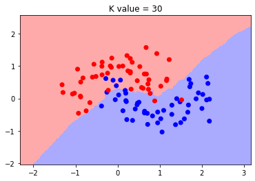
    


## Example-3


```python
data = np.genfromtxt('demo_data/2.concerticcir1.csv', delimiter=',')
knn_comparison(data, 1)
knn_comparison(data, 5)
knn_comparison(data,15)
knn_comparison(data,30)
```


    
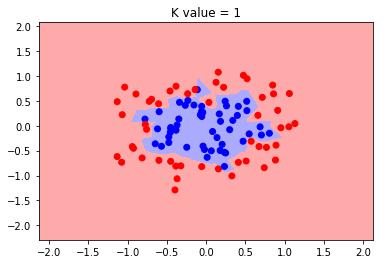
    


    
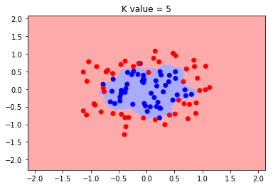
    


    

    


    
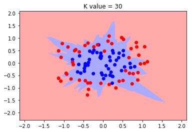
    


## Example-4


```python
data = np.genfromtxt('demo_data/3.concertriccir2.csv', delimiter=',')
knn_comparison(data, 1)
knn_comparison(data, 5)
knn_comparison(data, 15)
```


    

    


    

    


    

    


## Example-5


```python
data = np.genfromtxt('demo_data/4.linearsep.csv', delimiter=',')
knn_comparison(data, 1)
knn_comparison(data, 5)
knn_comparison(data)
```


    
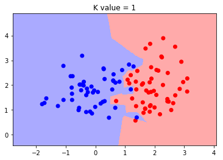
    


    

    


    

    


## Example-6


```python
data = np.genfromtxt('demo_data/5.outlier.csv', delimiter=',')
knn_comparison(data,1)
knn_comparison(data,5)
knn_comparison(data)
```


    
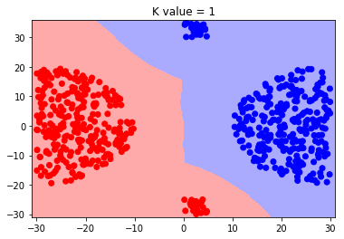
    


    

    


    

    


## Example-7


```python
data = np.genfromtxt('demo_data/7.xor.csv', delimiter=',')
knn_comparison(data, 1)
knn_comparison(data, 5)
knn_comparison(data)
```


    

    


    

    


    

    


## Example-8


```python
data = np.genfromtxt('demo_data/8.twospirals.csv', delimiter=',')
knn_comparison(data, 1)
knn_comparison(data, 5)
knn_comparison(data)
```


    
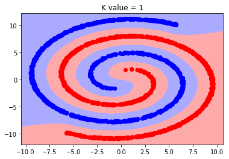
    


    

    


    

    


## Example-9


```python
data = np.genfromtxt('demo_data/9.random.csv', delimiter=',')
knn_comparison(data, 1)
knn_comparison(data, 5)
knn_comparison(data)

```


    
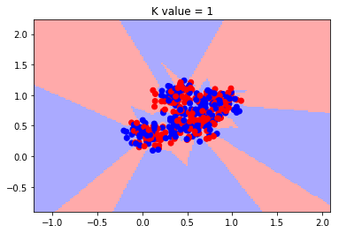
    


    

    


    

    


```python

```


```python

```
